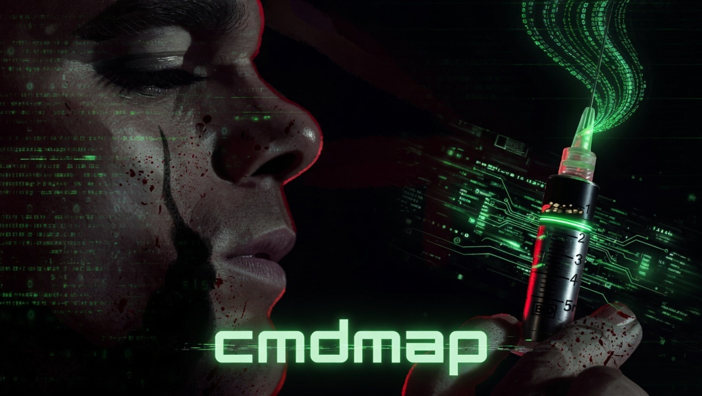

<p align="center">
  
</p>

<h1 align="center">CMDmap - Autonomous CMDi Detector</h1>

<p align="center">
  
  
  
  
</p>

---

## Overview

**CMDmap** (internally known as **CMDINJ**) is a high-fidelity, autonomous command injection detector designed for the modern web. Unlike traditional scanners, CMDmap uses a multi-tier verification engine to eliminate false positives and bypass sophisticated filters.

It transitions from simple reflection tests to complex timing-based attacks and Out-of-Band (OOB) interactions, culminating in a verified Proof-of-Concept (PoC).

---

## Core Features

1.  **SPA-Aware Crawler**: Deep extraction of endpoints from HTML and JavaScript/SPA environments.
2.  **Autonomous Fingerprinting**: Automatically detects the target OS (Linux/Windows) to tailor payloads.
3.  **Adaptive Evasion**: Generates encoded, space-bypassed (IFS, tab, brace), and differential timing payloads when direct execution fails.
4.  **5-Tier Injection Engine**:
    *   **Tier 1**: Direct Output (echo/token)
    *   **Tier 2**: Time-based Blind (auto-escalate)
    *   **Tier 3**: Output Redirection
    *   **Tier 4**: OOB (Self-hosted listener or Collaborator)
    *   **Tier 5**: Response-Adaptive Evasion (WAF bypass)
5.  **OOB Verification**: Includes a self-hosted OOB server for blind verification without external services.

---

## Installation

### Linux / macOS

```bash
git clone https://github.com/project-hellhound/cmdmap.git
cd cmdmap
chmod +x install.sh
./install.sh
```

This creates an isolated virtual environment and links the `cmdmap` command globally.

### Manual Setup

```bash
pip install -e .
```

---

## Usage

```bash
cmdmap https://target.com/api/v1/ping
```

### Advanced Options

| Flag | Description |
| :--- | :--- |
| `--cookie` | Session cookie or path to cookie file |
| `--header` | Custom HTTP header (e.g., `Authorization: Bearer ...`) |
| `--threads` | Concurrent scan threads (default: 10) |
| `--collab` | Custom OOB collaborator URL |
| `--verbose` | Enable high-fidelity debug logging |
| `--login-url` | Perform automated form-login before scanning |

### Authenticated Scan Example

```bash
cmdmap https://target.com/admin/tools --cookie "session=xyz123" --verbose
```

---

## Finding Classification

CMDmap categorizes findings based on the verification signal:

| Signal | Meaning | Confidence |
| :--- | :--- | :--- |
| `[FOUND:DIRECT]` | System output (e.g., `id`, `whoami`) reflected in response. | **100%** |
| `[FOUND:TIME]` | Validated execution via consistent timing delays. | **95%** |
| `[FOUND:OOB]` | Out-of-band interaction (DNS/HTTP) confirmed. | **100%** |
| `[VERIFY:REDIRECT]` | Potential execution confirmed via file write/readback. | **90%** |

---

## Legal

For authorized security testing only. The author and Project-Hellhound are not responsible for misuse or damage caused by this tool.

---

## Author

[**L4ZZ3RJ0D**](https://github.com/l4zz3rj0d)  

Integrated into the [Hellhound Pentest Framework](https://github.com/l4zz3rj0d/Hellhound-Pentest).
