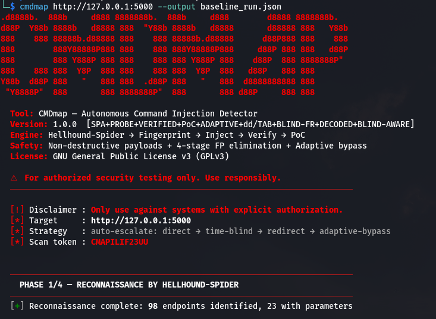
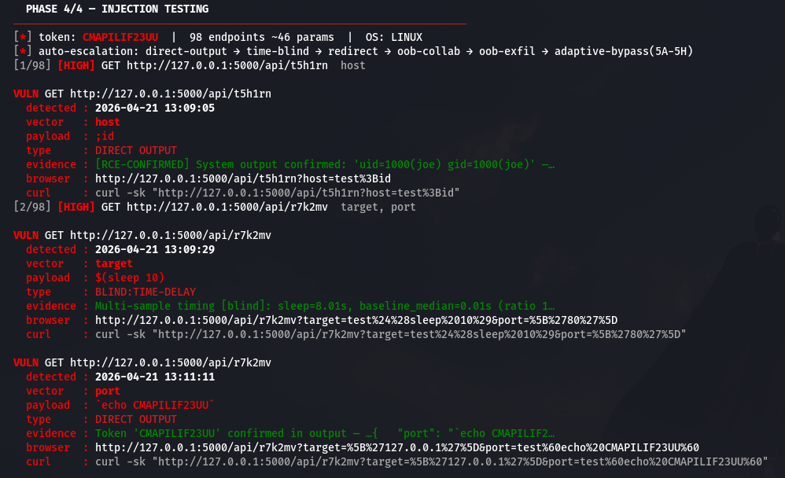
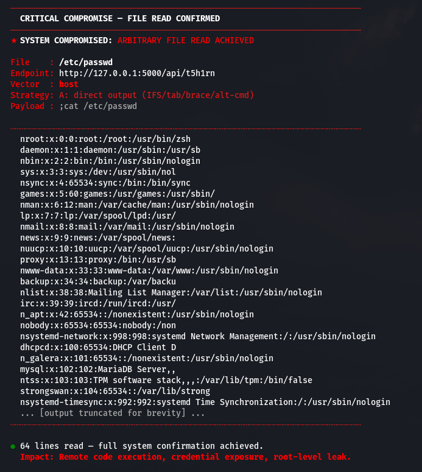

<p align="center">
  
</p>

<h1 align="center">CMDmap</h1>
<h3 align="center">Autonomous Command Injection Detector</h3>

<p align="center">
  
  
  
  
  
  
</p>

<p align="center">
  <b>SPA-aware &nbsp;·&nbsp; OS-fingerprinted &nbsp;·&nbsp; WAF-adaptive &nbsp;·&nbsp; OOB-verified &nbsp;·&nbsp; Zero false positives</b>
</p>

---

## Overview

CMDmap is a high-fidelity, autonomous command injection detector built for modern web targets. It pairs a SPA-aware crawler with a 5-tier injection engine that auto-escalates from direct output tests through timing-based blind detection to OOB callbacks — stopping only when execution is confirmed or all vectors are exhausted.

Every finding is verified, timestamped, and delivered with a ready-to-run `curl` PoC.

---

## Features

- **5-Tier Injection Engine** — Direct output → Time-blind → Redirect → OOB → Adaptive bypass
- **Adaptive WAF Evasion** — IFS/tab/brace, base64-wrap, hex, `dd`-timing, ANSI-C quoting, variable concat
- **Self-Hosted OOB Listener** — Blind CMDi confirmed without external collaborator
- **4-Stage False Positive Elimination** — Type detection, reflection filtering, error context analysis
- **Post-Exploitation File Read** — Auto-attempts `/etc/passwd` or `win.ini` after confirmed injection
- **Authenticated Scanning** — Cookie, Bearer token, or automated form login
- **Extensible Payload System** — Drop `.txt` files into `payloads/custom/` to extend coverage

---

## Installation

```bash
git clone https://github.com/project-hellhound/cmdmap.git
cd cmdmap
chmod +x install.sh
./install.sh
```

Requires Python 3.10+. Creates an isolated virtualenv and links `cmdmap` globally.

```bash
# Manual install
pip install -e .

# Initialize external payload directory
cmdmap --init-payloads
```

---

## Evidence

<p align="center">
  
</p>

<p align="center">
  
</p>

<p align="center">
  
</p>

---

## Usage

```bash
# Basic scan
cmdmap https://target.com/api/v1/ping

# Authenticated scan
cmdmap https://target.com/admin/ --cookie "session=abc123"

# Bearer token
cmdmap https://target.com/api/ --header "Authorization: Bearer <token>"

# Form login
cmdmap https://target.com/dashboard \
  --login-url https://target.com/login \
  --login-user admin --login-pass admin123

# Custom OOB collaborator
cmdmap https://target.com/ --collab https://your.interactsh.server

# Verbose
cmdmap https://target.com/ --verbose
```

---

## Options

| Flag | Description |
|:---|:---|
| `--cookie` | Session cookie or Authorization header |
| `--header` | Custom HTTP header (`Key: Value`) |
| `--threads` | Concurrent threads (default: 10) |
| `--collab` | External OOB collaborator URL |
| `--login-url` | Login endpoint for authenticated scans |
| `--login-user` / `--login-pass` | Login credentials |
| `--spider-json` | Import pre-crawled endpoints from JSON |
| `--force-os` | Override OS detection (`linux` \| `windows`) |
| `--time-thresh` | Timing threshold in seconds (default: 6.0) |
| `--json` | JSON output path (auto-generated if omitted) |
| `--init-payloads` | Create payload directory scaffold and exit |
| `--verbose` | Enable debug logging |

---

## Finding types

| Type | Confidence |
|:---|:---|
| `DIRECT OUTPUT` — system command output in response | 100% |
| `BLIND:TIME-DELAY` — statistically validated timing delay | 95% |
| `OOB` — DNS or HTTP callback confirmed | 100% |
| `REDIRECT` — file write + web readback verified | 90% |

---

## Part of Hellhound

CMDmap is the command injection agent in the [Hellhound Pentest Framework](https://github.com/project-hellhound-org/Hellhound-Pentest) and the CyArt VAPT platform.

---

## Legal

For authorized security testing only. Licensed under **GPLv3**.

---

<p align="center">
  Built by <a href="https://l4zz3rj0d.github.io"><b>L4ZZ3RJ0D</b></a> &nbsp;·&nbsp;
  <a href="https://github.com/project-hellhound/cmdmap">project-hellhound/cmdmap</a>
</p>


## Author

<div align="center">
  <a href="https://l4zz3rj0d.github.io">
    
  </a>
</div>